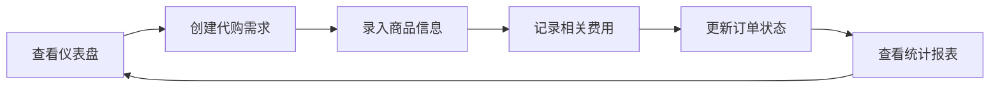

## 1. 产品概述

商品代购管理系统是一款帮助用户管理代购业务的全功能平台，解决代购过程中需求管理、商品追踪、费用核算和数据统计的痛点，提升代购效率和财务管理透明度。

- 主要用途：管理代购需求、追踪代购商品、核算代购费用、生成统计报表
- 目标用户：个人代购者、小型代购团队、海淘爱好者
- 产品价值：通过数字化管理提升代购业务效率，实时掌握经营状况

## 2. 核心功能

### 2.1 用户角色

| 角色 | 注册方式 | 核心权限 |
|------|----------|----------|
| 系统用户 | 默认登录 | 所有功能的完整访问权限 |

### 2.2 功能模块

1. **仪表盘**：数据概览、快速统计、快捷操作入口
2. **代购需求管理**：需求发布、需求列表、需求状态追踪
3. **代购商品列表**：商品录入、商品管理、采购状态追踪
4. **代购费用管理**：费用记录、成本核算、利润计算
5. **统计报表**：销售趋势、利润分析、商品排行、客户统计

### 2.3 页面详情

| 页面名称 | 模块名称 | 功能描述 |
|-----------|-------------|---------------------|
| 仪表盘 | 数据概览卡片 | 展示总订单数、总销售额、总利润、待处理需求 |
| 仪表盘 | 趋势图表 | 展示近30天销售和利润趋势 |
| 仪表盘 | 快捷操作 | 快速新增需求、新增商品、新增费用 |
| 代购需求 | 需求列表 | 展示所有代购需求，支持筛选和搜索 |
| 代购需求 | 新增/编辑需求 | 录入客户信息、商品需求、预算、截止日期 |
| 代购需求 | 需求详情 | 查看需求完整信息，更新状态 |
| 商品列表 | 商品列表 | 展示所有代购商品，支持多维度筛选 |
| 商品列表 | 新增/编辑商品 | 录入商品信息、采购价格、售价、状态 |
| 费用管理 | 费用列表 | 展示所有费用记录，分类统计 |
| 费用管理 | 新增/编辑费用 | 录入费用类型、金额、关联订单 |
| 统计报表 | 销售趋势 | 折线图展示月度/季度销售趋势 |
| 统计报表 | 利润分析 | 柱状图展示成本与利润对比 |
| 统计报表 | 商品排行 | 表格展示热销商品排行榜 |
| 统计报表 | 数据导出 | 支持报表数据导出为CSV格式 |

## 3. 核心流程

用户在系统中首先查看仪表盘了解整体经营状况，当收到客户代购请求时，在代购需求模块创建新需求，采购商品后在商品列表中录入商品信息，过程中产生的各项费用在费用管理模块记录，最后通过统计报表查看经营数据并进行分析决策。

## 4. 用户界面设计

### 4.1 设计风格

- **主色调**：深蓝色 #1e3a5f（专业、信任），搭配橙色 #f97316（活力、行动）
- **辅助色**：青色 #0ea5e9，绿色 #10b981，红色 #ef4444（状态标识）
- **中性色**：zinc色系，从50到900构建完整灰度体系
- **按钮风格**：圆角6px，微妙阴影，hover状态有轻微上浮效果
- **字体**：Inter 作为显示字体，思源黑体作为正文，建立清晰的字体层级
- **布局风格**：侧边导航 + 顶部工具栏 + 内容区卡片式布局
- **图标**：统一使用 lucide-react 线性图标，保持风格一致
- **动效**：页面切换淡入淡出，卡片hover轻微放大，数据加载骨架屏

### 4.2 页面设计概览

| 页面名称 | 模块名称 | UI元素 |
|-----------|-------------|-------------|
| 仪表盘 | 统计卡片 | 渐变色背景、大号数字、趋势箭头、图标装饰 |
| 仪表盘 | 图表区域 | 双折线图、平滑曲线、数据点hover提示 |
| 代购需求 | 列表页 | 表格布局、状态标签、搜索筛选栏、分页器 |
| 代购需求 | 表单页 | 分组表单、日期选择器、下拉选择、表单验证 |
| 统计报表 | 数据看板 | 多种图表组合、时间筛选、数据表格、导出按钮 |

### 4.3 响应式设计

- 采用桌面优先设计，适配1280px及以上分辨率
- 侧边栏在平板设备可折叠，移动端转为底部导航
- 表格在小屏幕转为卡片式列表展示
- 图表自适应容器宽度，保证数据可读性
- 触摸设备优化按钮尺寸，确保可点击区域不小于44px

