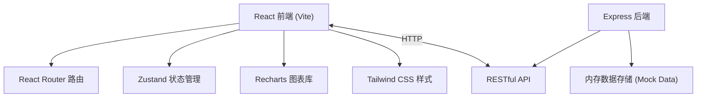
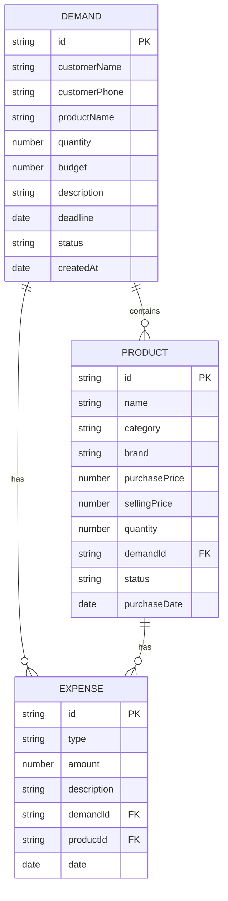

## 1. 架构设计



## 2. 技术描述

- **前端**：React@18 + TypeScript + Vite@6 + TailwindCSS@3 + Zustand@5 + React Router@7 + Recharts@3 + Lucide React
- **后端**：Express@4 + TypeScript + CORS
- **数据存储**：内存数据结构（Mock数据，支持后续接入真实数据库）
- **构建工具**：Vite + TypeScript Compiler
- **代码规范**：ESLint + Prettier

## 3. 路由定义

| 路由 | 页面 | 说明 |
|-------|---------|------|
| / | 仪表盘 | 数据概览和快捷操作 |
| /demands | 代购需求列表 | 展示所有代购需求 |
| /demands/new | 新增代购需求 | 创建新的代购需求 |
| /demands/:id | 需求详情 | 查看和编辑需求详情 |
| /products | 商品列表 | 展示所有代购商品 |
| /products/new | 新增商品 | 添加新的代购商品 |
| /products/:id | 商品详情 | 查看和编辑商品详情 |
| /expenses | 费用管理 | 展示和管理费用记录 |
| /reports | 统计报表 | 数据可视化报表 |

## 4. API 定义

### 4.1 类型定义

```typescript
// 代购需求
interface Demand {
  id: string;
  customerName: string;
  customerPhone: string;
  productName: string;
  quantity: number;
  budget: number;
  description: string;
  deadline: string;
  status: 'pending' | 'purchasing' | 'shipping' | 'completed' | 'cancelled';
  createdAt: string;
  updatedAt: string;
}

// 代购商品
interface Product {
  id: string;
  name: string;
  category: string;
  brand: string;
  purchasePrice: number;
  sellingPrice: number;
  quantity: number;
  demandId?: string;
  status: 'pending' | 'purchased' | 'shipped' | 'delivered';
  purchaseDate?: string;
  remark?: string;
  createdAt: string;
}

// 费用记录
interface Expense {
  id: string;
  type: 'purchase' | 'shipping' | 'service' | 'tax' | 'other';
  amount: number;
  description: string;
  demandId?: string;
  productId?: string;
  date: string;
  createdAt: string;
}

// 统计数据
interface Statistics {
  totalOrders: number;
  totalSales: number;
  totalProfit: number;
  totalExpenses: number;
  pendingDemands: number;
}
```

### 4.2 API 接口

| 方法 | 路径 | 说明 | 请求 | 响应 |
|------|------|------|------|------|
| GET | /api/statistics | 获取统计概览 | - | Statistics |
| GET | /api/demands | 获取需求列表 | ?status=&search= | Demand[] |
| GET | /api/demands/:id | 获取需求详情 | - | Demand |
| POST | /api/demands | 创建需求 | Demand | Demand |
| PUT | /api/demands/:id | 更新需求 | Partial<Demand> | Demand |
| DELETE | /api/demands/:id | 删除需求 | - | { success: boolean } |
| GET | /api/products | 获取商品列表 | ?status=&category= | Product[] |
| GET | /api/products/:id | 获取商品详情 | - | Product |
| POST | /api/products | 创建商品 | Product | Product |
| PUT | /api/products/:id | 更新商品 | Partial<Product> | Product |
| DELETE | /api/products/:id | 删除商品 | - | { success: boolean } |
| GET | /api/expenses | 获取费用列表 | ?type= | Expense[] |
| POST | /api/expenses | 创建费用 | Expense | Expense |
| PUT | /api/expenses/:id | 更新费用 | Partial<Expense> | Expense |
| DELETE | /api/expenses/:id | 删除费用 | - | { success: boolean } |
| GET | /api/reports/sales | 销售趋势报表 | ?startDate=&endDate= | { date: string; sales: number; profit: number }[] |
| GET | /api/reports/products | 商品排行 | ?limit= | { product: Product; count: number; revenue: number }[] |

## 5. 服务器架构


## 6. 数据模型

### 6.1 实体关系图



### 6.2 Mock 数据初始化

系统启动时自动初始化Mock数据，包含：
- 10条代购需求记录（不同状态）
- 15条代购商品记录（多个分类）
- 20条费用记录（多种类型）
- 确保数据时间跨度覆盖最近3个月，便于报表展示
